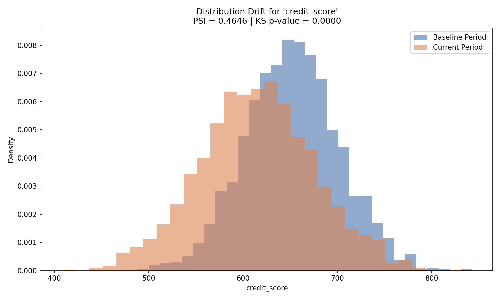

## Drift Detection Example

Below is a real drift check on the `credit_score` feature comparing the baseline period to the current period:



- **PSI: 0.4646** → indicates significant distribution drift
- **KS test**: drift detected (p-value below 0.05 threshold)

This shows the pipeline correctly flagging a feature whose distribution has shifted meaningfully between the two time periods — the kind of signal that would trigger a model retraining review in production.## 📊 Results

- PSI detects distribution shifts in feature distributions
- KS test validates statistical differences between datasets
- 5/5 unit tests passing ensuring correctness of drift logic

## ▶️ How to Run

```bash
pip install -r requirements.txt
python src/main.py
pytest tests/# Model Drift Detection in Credit Risk

## Overview

This project monitors deployed machine learning models for credit risk prediction and detects model drift using statistical techniques.

## Features

- Population Stability Index (PSI)
- Kolmogorov-Smirnov (KS) Drift Detection
- Automated Drift Monitoring
- Risk Assessment
- Modular Python Architecture

## Project Structure

```
model-drift-detection-credit-risk/
│
├── notebooks/
├── src/
├── tests/
├── requirements.txt
└── README.md
```

## Technologies Used

- Python
- Pandas
- NumPy
- SciPy
- Scikit-learn
- Jupyter Notebook

## Business Value

Model drift can reduce prediction quality over time. This project helps identify changes in incoming data distributions and supports proactive model monitoring in credit risk environments.

## Future Improvements

- Real-time monitoring dashboard
- Automated alerts
- Model retraining pipeline
- Cloud deployment

## Author

Srinija Garapati
